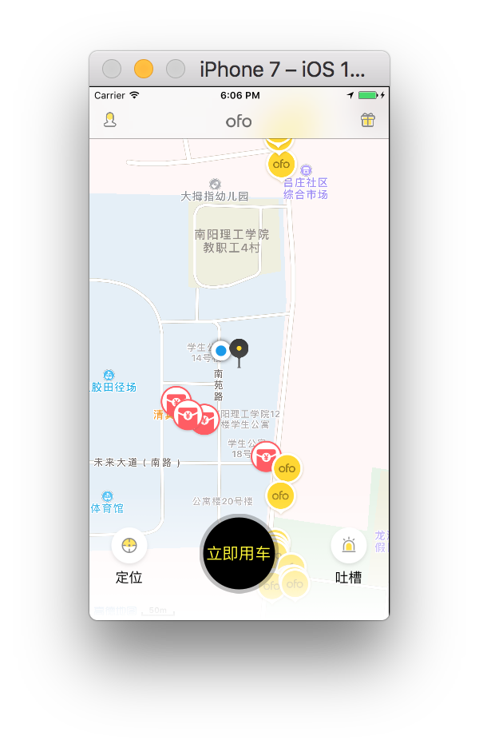
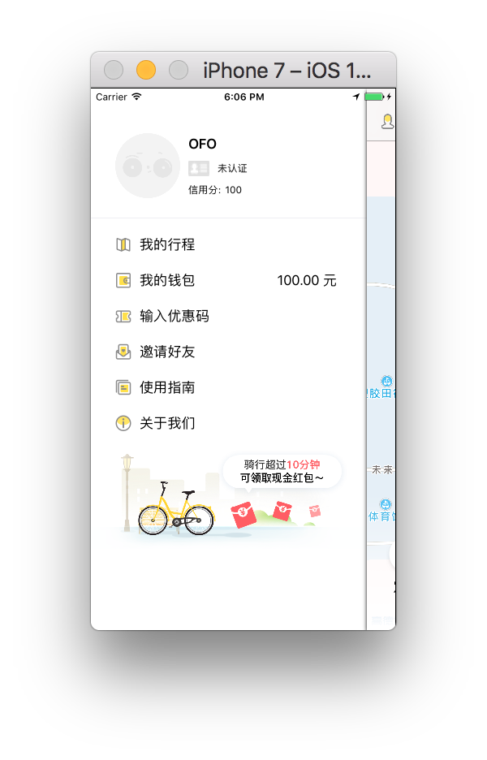
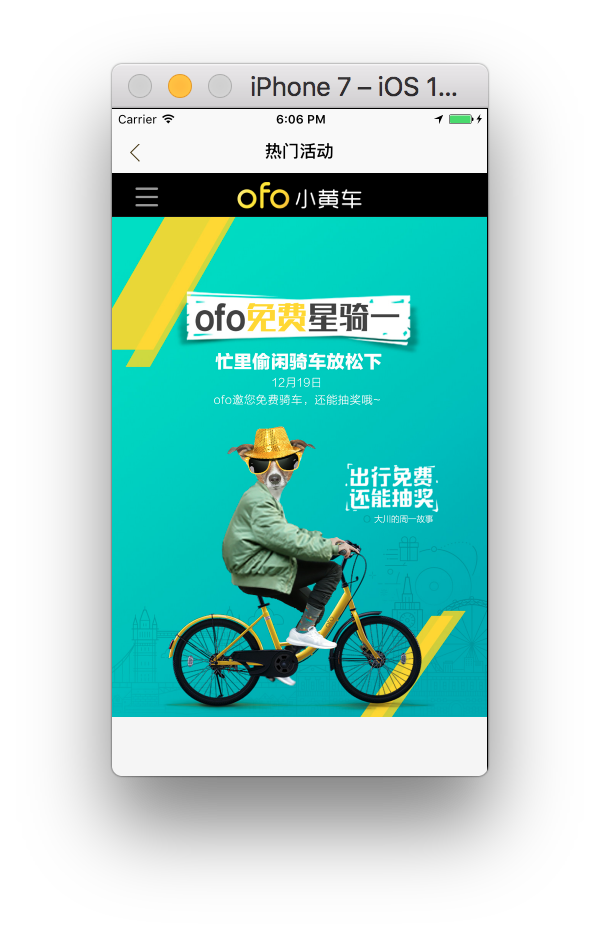
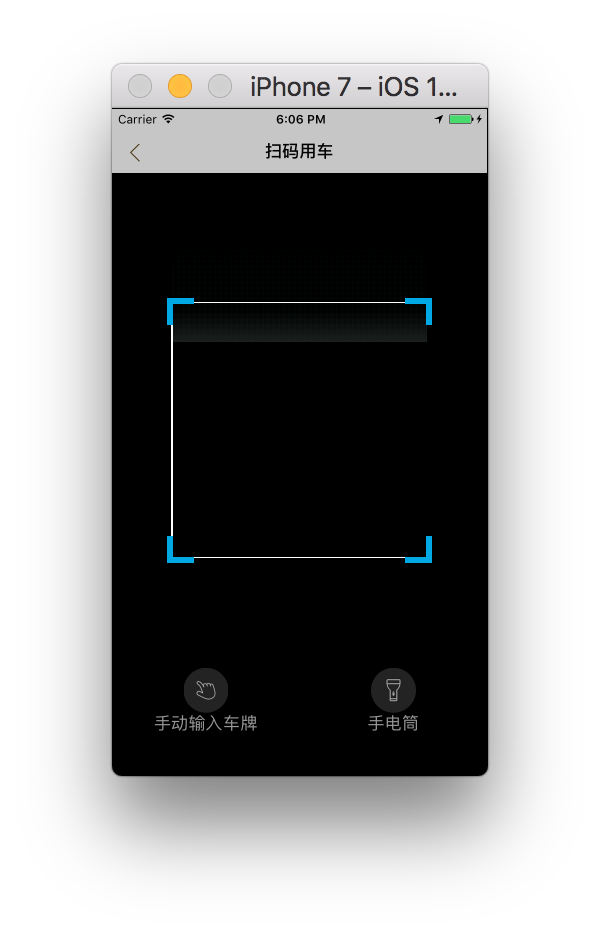
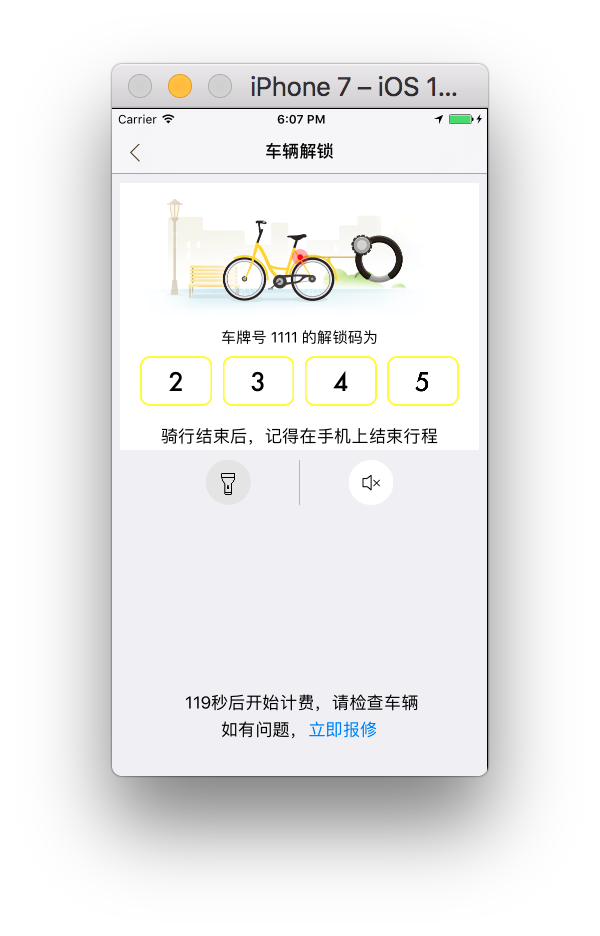

# OFOBike

A demo app like OFO Bike in Swift.

 

## Preface

该 Repo 是 OFO 小黄车的「部分」模仿 App。2017 年 5 月左右开始写，由于之前配置 .girignore 未将 Cocoapods 处忽略，导致整个包过大，而且 Commit 较乱。最近将代码重新整理，并开源。

项目整体采用了 MVC 架构，使用 Swift 3.x 编写，后台采用 LeanCloud，地图为高德地图提供，并集成了 Fabric。

PS: 该 App 非目前最新版 OFO 共享单车 UI。

## How to run?

在 AppDelegat.swift 中设置您的高德地图 Key 以及 LeanCloud Key；Fabric 的 Key 需要在 Info.plist 中设置。

## Screenshots

- Launch image


- 主页



- 侧边栏(仅 UI, SWRevealViewController)



- 热门互动(WKWebView)



- 扫码用车(SwiftScan)



- 输入车牌号(APNumberPad)


- 显示解锁码



- 车牌号错误(MIBlurPopup)


## Podfile

```
target 'OFOBike' do
  # Comment the next line if you're not using Swift and don't want to use dynamic frameworks
  use_frameworks!

  # Pods for OFOBike
  
  # Fabric
  pod 'Fabric'
  pod 'Crashlytics'
  
  # Side menu
  pod 'SWRevealViewController'
  
  # Map
  pod 'AMapNavi'
  pod 'AMapSearch'
  pod 'AMapLocation'
  
  # HUD
  pod 'FTIndicator'

  # QR Code
  pod 'swiftScan'

  # Number Pad
  pod 'APNumberPad'
  
  # Timer
  pod 'SwiftyTimer'
  
  # Sounds
  pod 'SwiftySound'
  
  # Lean Cloud
  pod 'AVOSCloud'
  
  # Pop up
  pod 'MIBlurPopup'
end
```

## LICENSE

部分资源解包自 OFO 共享单车.ipa，许可等归其官方解释。其余部分许可为 MIT。
